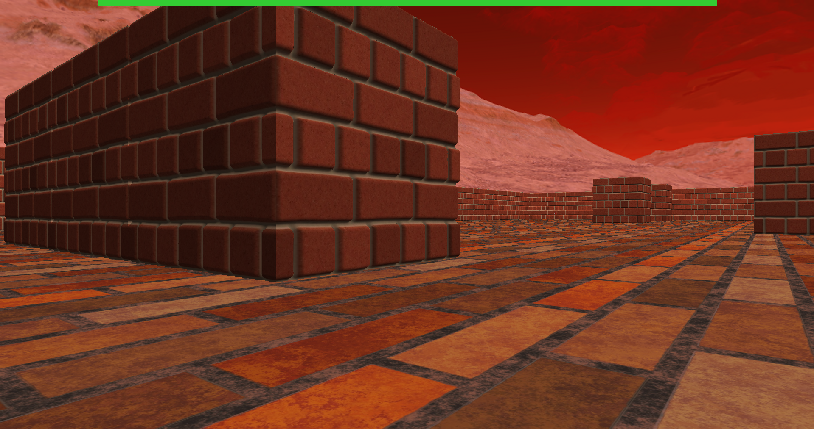

# PP-4-GKiW-doom
Recreation of popular game Doom using OpenGL
Made with [KanarXD](https://github.com/KanarXD)

## Controls
| Input        | Function        |
| ------------ | :-------------- |
| `WSAD`       | Player movement |
| `Left Shift` | Sprinting       |
| `Left Ctrl`  | Crouching       |
| `Space`      | Jumping         |
| `Esc` 	   | Close game      |
| `Mouse`      | Camera movement |
| `LPM`        | Shoot           |

### Screen shots from the game

	 
	

	 
	

### Enemies models made in Blender

